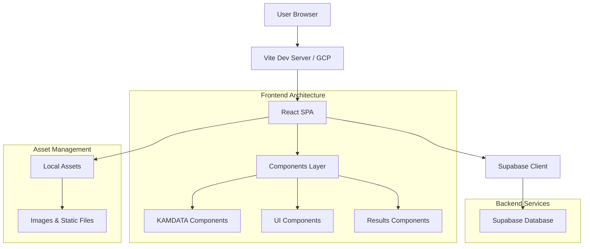

# KAMDATA Digital Mindset Test Application

## 📋 Project Overview

The KAMDATA Digital Mindset Test is an interactive web application designed to evaluate users' digital mindset across three key dimensions: **Mentalidad Ágil** (Agile Mindset), **Mentalidad de Crecimiento** (Growth Mindset), and **Mentalidad Exponencial** (Exponential Mindset). The application provides a comprehensive assessment experience with personalized results, PDF generation, and WhatsApp integration for community engagement.

### Key Features
- **Interactive Assessment**: 15-question test covering three mentalities with Likert-scale responses
- **Real-time Results**: Dynamic scoring and interpretation with personalized insights
- **PDF Generation**: Automated report generation using html2canvas and jsPDF
- **Social Integration**: WhatsApp community links and social media sharing
- **Responsive Design**: Mobile-first approach with Tailwind CSS
- **Animations**: Smooth transitions using Framer Motion
- **Data Persistence**: Supabase integration for result storage

### Technology Stack
- **Frontend**: React 18 with Vite build tool
- **Styling**: Tailwind CSS with custom KAMDATA branding
- **Animations**: Framer Motion for smooth interactions
- **Backend**: Firebase/Firestore for unified data collection and storage
- **UI Components**: Radix UI primitives with custom styling
- **PDF Generation**: html2canvas + jsPDF for report export
- **Deployment**: Google Cloud Platform (GCP)

## 🏗️ Architecture Overview



### System Components

#### Frontend Architecture
- **React SPA**: Single-page application built with React 18 and hooks
- **Vite Build Tool**: Fast development server and optimized production builds
- **Component Architecture**:
  - `src/components/kamdata/`: Core application components (TestStep, ResultsStep, etc.)
  - `src/components/results/`: Results visualization components
  - `src/components/ui/`: Reusable UI primitives (Card, Input, Select, etc.)

#### Backend Integration
- **Firebase/Firestore**: NoSQL database for unified data collection
- **Client Configuration**: Firebase SDK initialization with environment variables
- **Data Models**: Structured test results collection with RLS security rules
- **Security**: Anonymous user access for INSERT and SELECT operations

#### Asset Management
- **Local Assets**: Static files stored in `public/` directory
- **Image Optimization**: CDN migration to local hosting for better performance
- **Responsive Images**: Multiple sizes for different screen resolutions

#### Deployment Infrastructure
- **Google Cloud Platform**: Scalable cloud hosting
- **Automated Pipelines**: YAML-based CI/CD with Cloud Build
- **Environment Management**: Separate staging and production environments

## 📁 Code Structure and Main Files

```
src/
├── components/
│   ├── kamdata/                    # Core application components
│   │   ├── CommunityModal.jsx      # WhatsApp community modal
│   │   ├── Footer.jsx              # Site footer with social links
│   │   ├── IntroStep.jsx           # User information collection form
│   │   ├── KamdataLogo.jsx         # Animated logo component
│   │   ├── ResultsStep.jsx         # Main results display component
│   │   ├── TestStep.jsx            # Question display and navigation
│   │   ├── WhatsAppButton.jsx      # Floating contact button with pulse animation
│   │   └── testConfig.js           # Test questions and configuration
│   ├── results/                    # Results visualization components
│   │   ├── PdfContent.jsx          # PDF report generation
│   │   ├── ResultsActions.jsx      # Share and download actions
│   │   ├── ResultsBarChart.jsx     # Score visualization chart
│   │   ├── ResultsInterpretation.jsx # Personalized insights
│   │   ├── ResultsRoadmap.jsx      # Action recommendations
│   │   ├── ResultsSectionCards.jsx # Individual mentality scores
│   │   ├── ResultsSummaryCard.jsx  # Overall score summary
│   │   ├── StrategicSessionCTA.jsx # Call-to-action component
│   │   └── index.js                # Component exports
│   └── ui/                         # Reusable UI components
│       ├── button.jsx              # Button component with variants
│       ├── card.jsx                # Card layout components
│       ├── checkbox.jsx            # Form checkbox input
│       ├── input.jsx               # Form text input
│       ├── label.jsx               # Form labels
│       ├── select.jsx              # Dropdown select component
│       ├── toast.jsx               # Toast notification primitives
│       ├── toaster.jsx             # Toast container
│       └── use-toast.jsx           # Toast state management hook
├── lib/
│   ├── supabaseClient.js           # Supabase client configuration
│   └── utils.js                    # Utility functions (cn for class merging)
├── App.jsx                         # Main application component
├── index.css                       # Global styles and Tailwind imports
└── main.jsx                        # Application entry point
```

### Key Files Explanation

#### Entry Points
- **`src/main.jsx`**: React application bootstrap with strict mode
- **`src/App.jsx`**: Main application logic and routing

#### Core Components
- **`WhatsAppButton.jsx`**: Features bottom-left positioning and continuous pulse animation for user engagement
- **`TestStep.jsx`**: Handles question display with progress tracking and smooth transitions
- **`ResultsStep.jsx`**: Comprehensive results dashboard with PDF generation

#### Configuration Files
- **`vite.config.js`**: Build configuration with React plugin and path aliases
- **`tailwind.config.js`**: Tailwind CSS configuration with custom colors
- **`testConfig.js`**: Question definitions for the three mentalities assessment
- **`firebase.js`**: Firebase client configuration and initialization

#### DevOps Considerations
- **Testing**: Component-level unit tests using Jest and React Testing Library
- **Debugging**: Console logging, error boundaries, and browser dev tools integration
- **Performance**: Code splitting, lazy loading, and optimized bundle sizes
- **Security**: Environment variable management and secure API communications

## 🚀 Development Setup

### Prerequisites
- **Node.js**: Version 18.0.0 or higher
- **npm**: Version 8.0.0 or higher (comes with Node.js)
- **Git**: For version control

### Installation Steps

1. **Clone the repository**:
   ```bash
   git clone <repository-url>
   cd kamdata_test_mentalidad_digital
   ```

2. **Install dependencies**:
   ```bash
   npm install
   ```

3. **Set up environment variables**:
   Create a `.env.local` file in the root directory:
   ```env
   VITE_FIREBASE_API_KEY=your-firebase-api-key
   VITE_FIREBASE_AUTH_DOMAIN=your-project.firebaseapp.com
   VITE_FIREBASE_PROJECT_ID=your-project-id
   VITE_FIREBASE_STORAGE_BUCKET=your-project.appspot.com
   VITE_FIREBASE_MESSAGING_SENDER_ID=your-sender-id
   VITE_FIREBASE_APP_ID=your-app-id
   ```

4. **Migrate assets to local**:
   ```bash
   mkdir public
   # Move images from CDN to public/ directory
   # Update image references in components from CDN URLs to local paths
   ```

5. **Start development server**:
   ```bash
   npm run dev
   ```

   The application will be available at `http://localhost:5173` (or next available port).

### Available Scripts
- `npm run dev`: Start development server with hot reload
- `npm run build`: Build for production
- `npm run preview`: Preview production build locally
- `npm run lint`: Run ESLint for code quality checks

## 🚢 Deployment Guide

### Google Cloud Platform Setup

1. **Create GCP Project**:
   ```bash
   gcloud projects create kamdata-mindset-test
   gcloud config set project kamdata-mindset-test
   ```

2. **Enable Required APIs**:
   ```bash
   gcloud services enable run.googleapis.com
   gcloud services enable cloudbuild.googleapis.com
   ```

3. **Build and Deploy**:
   ```bash
   # Build the application
   npm run build

   # Deploy to Cloud Run
   gcloud run deploy kamdata-mindset-test \
     --source . \
     --platform managed \
     --region us-central1 \
     --allow-unauthenticated
   ```

### CI/CD Pipeline Configuration

Create `.cloudbuild.yaml` in the repository root:

```yaml
steps:
  - name: 'gcr.io/cloud-builders/npm'
    args: ['install']
  - name: 'gcr.io/cloud-builders/npm'
    args: ['run', 'build']
  - name: 'gcr.io/cloud-builders/docker'
    args: ['build', '-t', 'gcr.io/$PROJECT_ID/kamdata-mindset-test', '.']
  - name: 'gcr.io/cloud-builders/docker'
    args: ['push', 'gcr.io/$PROJECT_ID/kamdata-mindset-test']
  - name: 'gcr.io/google.com/cloudsdktool/cloud-sdk'
    entrypoint: gcloud
    args:
      - 'run'
      - 'deploy'
      - 'kamdata-mindset-test'
      - '--image'
      - 'gcr.io/$PROJECT_ID/kamdata-mindset-test'
      - '--region'
      - 'us-central1'
      - '--platform'
      - 'managed'
      - '--allow-unauthenticated'

options:
  logging: CLOUD_LOGGING_ONLY
```

### Environment Variables
Set environment variables in GCP:
```bash
gcloud run services update kamdata-mindset-test \
  --set-env-vars VITE_FIREBASE_API_KEY=your-key,VITE_FIREBASE_PROJECT_ID=your-project \
  --region us-central1
```

### Firebase/Firestore Setup
1. **Create Firebase Project**:
   - Go to [Firebase Console](https://console.firebase.google.com/)
   - Create a new project or select existing GCP project

2. **Enable Firestore Database**:
   - Navigate to Firestore Database in the Firebase console
   - Create database in production mode
   - Set up security rules for anonymous access

3. **Firestore Security Rules**:
   ```javascript
   rules_version = '2';
   service cloud.firestore {
     match /databases/{database}/documents {
       // Allow anonymous users to insert test results
       match /kamdata_test_results/{document} {
         allow create: if request.auth == null;
         allow read: if request.auth == null;
       }
     }
   }
   ```

4. **Database Schema**:
   ```sql
   -- Firestore Collection: kamdata_test_results
   -- Document Structure (equivalent to SQL table):
   {
     id: string (auto-generated document ID),
     nombre: string,
     celular: string,
     email: string,
     empresa: string,
     ciudad: string,
     answers_agil: object (JSON),
     answers_crecimiento: object (JSON),
     answers_exponencial: object (JSON),
     score_agil: number,
     score_crecimiento: number,
     score_exponencial: number,
     overall_score: number,
     completed_at: timestamp,
     created_at: timestamp,
     info_mentorias: boolean,
     roles: object (JSON array),
     rol_otro_texto: string,
     fuente_test: string,
     fuente_test_detalle_texto: string,
     fuente_test_detalle_red_social: string,
     terminos: boolean
   }
   ```

### Data Migration
Existing data from Supabase is available in CSV format:
- **Location**: `public/kamdata_test_results_rows-2.csv`
- **Import Process**: Use Firebase Admin SDK or console import tools
- **Data Volume**: All test results collected since project inception

## 🔧 DevOps Principles and Best Practices

### Testing Strategy
```bash
# Install testing dependencies
npm install --save-dev jest @testing-library/react @testing-library/jest-dom

# Run tests
npm test

# Example component test
import { render, screen } from '@testing-library/react';
import WhatsAppButton from './WhatsAppButton';

test('renders WhatsApp button with pulse animation', () => {
  render(<WhatsAppButton />);
  const button = screen.getByRole('link');
  expect(button).toBeInTheDocument();
  expect(button).toHaveClass('fixed', 'bottom-4', 'left-4');
});
```

### Debugging and Monitoring
- **Browser DevTools**: Network tab for API calls, Console for logs
- **Error Boundaries**: Wrap components to catch and report errors
- **Performance Monitoring**: Use Lighthouse for performance audits
- **Logging**: Structured logging with different levels (info, warn, error)

### Version Control
- **Commit Frequency**: Regular commits with descriptive messages
- **Branch Strategy**: Feature branches with pull requests
- **Code Reviews**: Mandatory reviews for all changes
- **Release Tags**: Semantic versioning for releases

### Scalability Considerations
- **Component Modularity**: Easy to add new test sections or question types
- **API Abstraction**: Supabase client can be replaced with other backends
- **Asset Optimization**: Image optimization and lazy loading
- **Performance Budgets**: Monitor bundle sizes and loading times

## 🤝 Contributing and Future Enhancements

### Contribution Guidelines
1. Fork the repository and create a feature branch
2. Follow the existing code style and component patterns
3. Add tests for new functionality
4. Update documentation as needed
5. Submit a pull request with a clear description

### Code Review Checklist
- [ ] Component follows established patterns
- [ ] Proper TypeScript types (if applicable)
- [ ] Responsive design considerations
- [ ] Accessibility compliance
- [ ] Performance optimizations
- [ ] Tests included and passing

### Future Enhancement Examples

#### Adding New Test Sections
```javascript
// In testConfig.js
export const questions = {
  // ... existing sections
  innovacion: [
    {
      text: "New question for innovation mentality",
      options: [
        { text: "Option 1", value: 1 },
        { text: "Option 2", value: 2 },
        // ... more options
      ]
    }
  ]
};
```

#### Firebase Analytics Integration
```javascript
// Add Firebase Analytics tracking
import { getAnalytics, logEvent } from 'firebase/analytics';

const handleAnswer = (answer) => {
  logEvent(getAnalytics(), 'question_answered', {
    questionId: currentQuestion.id,
    answer: answer.value,
    section: currentSection
  });
  // ... rest of logic
};
```

#### Firestore Data Operations
```javascript
// Example of saving test results to Firestore
import { collection, addDoc } from 'firebase/firestore';
import { db } from './firebase';

const saveTestResults = async (results) => {
  try {
    const docRef = await addDoc(collection(db, 'kamdata_test_results'), {
      ...results,
      created_at: new Date(),
      completed_at: new Date()
    });
    console.log('Test results saved with ID:', docRef.id);
  } catch (error) {
    console.error('Error saving test results:', error);
  }
};
```

#### Component Enhancement Example
Recent commits demonstrate component improvements:
- **WhatsApp Button**: Moved to bottom-left with pulse animation for better UX
- **UI Components**: Consistent styling with Radix UI primitives
- **Results Visualization**: Interactive charts and PDF generation

### Documentation Updates
- Keep this README current with new features
- Add API documentation for backend integrations
- Include troubleshooting guides for common issues

---

## 📞 Support and Contact

For questions or support:
- **WhatsApp**: [KAMDATA Support](https://wa.me/message/X7EEXB5WU6QAM1)
- **Email**: contacto@kamdata.com.mx
- **Website**: [kamdata.com.mx](https://kamdata.com.mx)

## 📊 Database Schema & Data Management

### Firestore Collection Structure

```mermaid
graph TD
    A[kamdata_test_results Collection] --> B[Document ID: Auto-generated UUID]
    B --> C[User Information]
    B --> D[Test Answers]
    B --> E[Test Scores]
    B --> F[Metadata]

    C --> C1[nombre: string]
    C --> C2[celular: string]
    C --> C3[email: string]
    C --> C4[empresa: string]
    C --> C5[ciudad: string]
    C --> C6[roles: object - JSON array]
    C --> C7[rol_otro_texto: string]

    D --> D1[answers_agil: object - JSON]
    D --> D2[answers_crecimiento: object - JSON]
    D --> D3[answers_exponencial: object - JSON]

    E --> E1[score_agil: number]
    E --> E2[score_crecimiento: number]
    E --> E3[score_exponencial: number]
    E --> E4[overall_score: number]

    F --> F1[created_at: timestamp]
    F --> F2[completed_at: timestamp]
    F --> F3[info_mentorias: boolean]
    F --> F4[fuente_test: string]
    F --> F5[fuente_test_detalle_texto: string]
    F --> F6[fuente_test_detalle_red_social: string]
    F --> F7[terminos: boolean]
```



### SQL Schema Reference (for migration purposes)

```sql
-- Original Supabase PostgreSQL schema (for reference)
CREATE TABLE public.kamdata_test_results (
  id uuid NOT NULL DEFAULT gen_random_uuid(),
  nombre text NULL,
  celular text NULL,
  email text NULL,
  empresa text NULL,
  ciudad text NULL,
  answers_agil jsonb NULL,
  answers_crecimiento jsonb NULL,
  answers_exponencial jsonb NULL,
  score_agil integer NULL,
  score_crecimiento integer NULL,
  score_exponencial integer NULL,
  overall_score integer NULL,
  completed_at timestamp with time zone NULL DEFAULT now(),
  created_at timestamp with time zone NULL DEFAULT now(),
  info_mentorias boolean NULL DEFAULT false,
  roles jsonb NULL,
  rol_otro_texto text NULL,
  fuente_test text NULL,
  fuente_test_detalle_texto text NULL,
  fuente_test_detalle_red_social text NULL,
  terminos boolean NULL,
  CONSTRAINT kamdata_test_results_pkey PRIMARY KEY (id)
) TABLESPACE pg_default;
```

### Data Export & Migration

- **CSV Export Location**: `public/kamdata_test_results_rows-2.csv`
- **Data Volume**: All test results collected since project inception
- **Migration Tools**: Firebase Admin SDK or console import utilities
- **Data Integrity**: Maintains all user responses and calculated scores

### Security Rules (Firestore)

```javascript
rules_version = '2';
service cloud.firestore {
  match /databases/{database}/documents {
    // Allow anonymous users to insert test results
    match /kamdata_test_results/{document} {
      allow create: if request.auth == null;
      allow read: if request.auth == null;
    }
  }
}
```

## � License

This project is proprietary to KAMDATA. All rights reserved.

---

*Last updated: November 2025*
*Maintained by: KAMDATA Development Team*